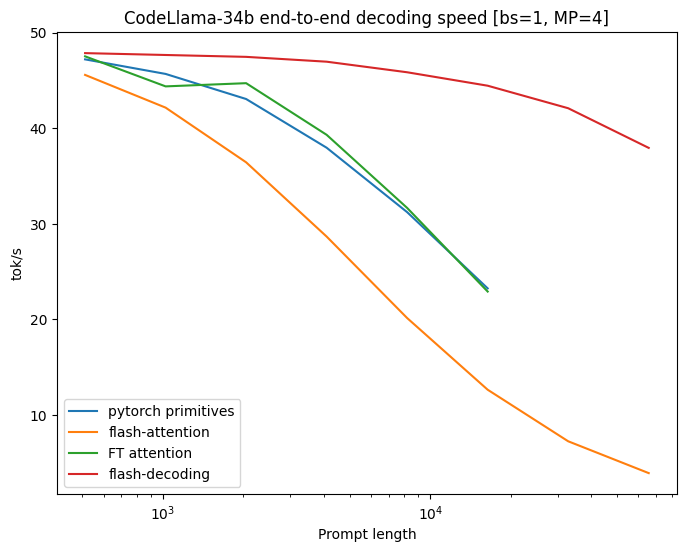
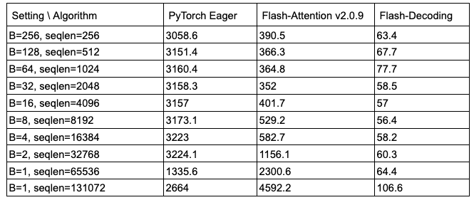

# Flash-Decoding for long-context inference

- **原文链接**: [Flash-Decoding for long-context inference](https://crfm.stanford.edu/2023/10/12/flashdecoding.html)
- **发布日期**: 2023-10-12
- **作者**: Tri Dao, Daniel Haziza, Francisco Massa, Grigory Sizov

## 核心要点

### 1. 为什么需要它？(Motivation)
大家都知道 LLM 推理很贵，尤其是当上下文（Context）变得很长的时候，Attention 层的计算就成了最大的瓶颈。

你可能会问，不是已经有 **FlashAttention** 了吗？
是的，FlashAttention 在**训练**时确实非常快，因为它能并行处理 Batch Size 和 Query Length。但在**推理**（生成）阶段，情况就不一样了：
- **推理是逐个 token 生成的**，也就是说 Query Length 通常只有 1。
- 为了处理超长上下文，显存限制往往迫使我们将 Batch Size 设得很小（甚至是 1）。
- 在这种情况下，FlashAttention 没法喂饱 GPU，几百个计算单元（SMs）大部分都在看戏，利用率甚至不到 **1%**！

*FlashAttention 只对 Batch Size 和 Query Blocks 进行并行，在推理（Decoding）阶段，由于 Query Length=1 且 Batch Size 小，无法占满 GPU。*

### 2. 它是怎么做的？(Flash-Decoding)
Flash-Decoding 的核心思路很简单：**既然 Batch 维度并行不起来，那我们就去并行 KV Cache 的序列长度维度。**

它把计算过程分成了三步：
1. **拆分 (Split)**: 把长长的 Keys 和 Values 序列切分成很多小块（Chunks）。
2. **并行计算 (Parallel Compute)**: 利用 FlashAttention 的原理，让 GPU 的计算单元并行地去计算 Query 和这些小块之间的注意力。这一步除了算出 Attention 值，还会顺手记录一个统计量（log-sum-exp）。
3. **汇总 (Reduce)**: 最后把各个小块计算出的结果汇总起来，根据刚才记录的统计量进行加权，得到最终正确的输出。

*Flash-Decoding 增加了沿 Keys/Values 序列长度的并行维度，充分利用 GPU。*

简单来说，就是**化整为零，分而治之**。

### 3. 效果如何？
- **速度飞起**: 在 CodeLlama-34b 上测试，对于超长序列，解码速度最高提升了 **8倍**。
- **无视长度**: 非常神奇的是，在序列长度达到 32k 之前，Attention 的计算耗时几乎是恒定的，不会随着长度增加而变慢。
- **吊打同行**: 相比 PyTorch 原生实现、老版 FlashAttention v2 甚至 FasterTransformer，它在长文本场景下的表现是碾压级的。

*CodeLlama 34B 上的解码速度测试，Flash-Decoding 在长序列下表现优异。*

*Attention 内核的微基准测试，Flash-Decoding 实现了随序列长度几乎恒定的运行时间。*

### 4. 怎么用？
只要更新库就可以用了：
- **FlashAttention**: 升级到 2.2 或以上版本。
- **xFormers**: 升级到 0.0.22 或以上版本 (会自动调度使用)。
